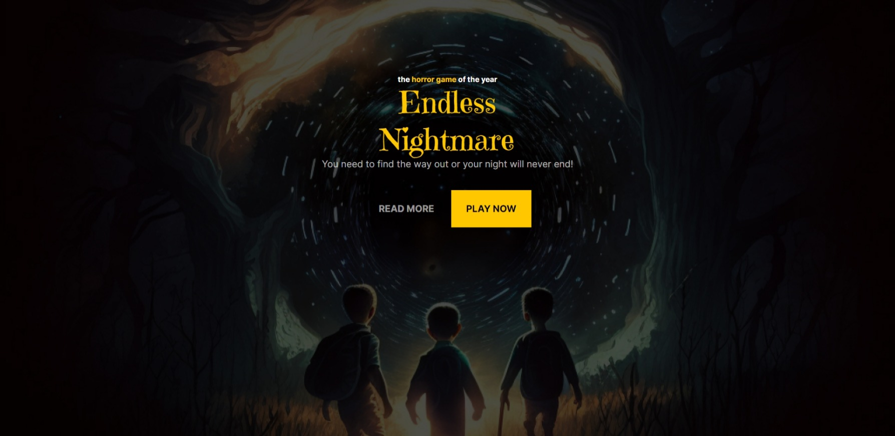

<h1 align="center"> Endless Nightmare </h1>

Página inicial de um game de terror.

 

 

## 🚀 Tecnologias

Esse projeto foi desenvolvido com as seguintes tecnologias:

- HTML e CSS

## 💻 Projeto

Apenas uma simulação de página inicial de um game de terror.

- [Acesse o projeto finalizado, online](https://dgpimenta.github.io/nlw-setup-explorer)

## 🔖 Layout

Você pode visualizar o layout do projeto através [DESSE LINK](https://www.figma.com/file/nzvumHawtKh4kebZZrHVu3/Horror-Game-LP-(Community)?node-id=0%3A1&t=jrEDAyfeusAnmzmG-0). É necessário ter conta no [Figma](https://figma.com) para acessá-lo.

---

